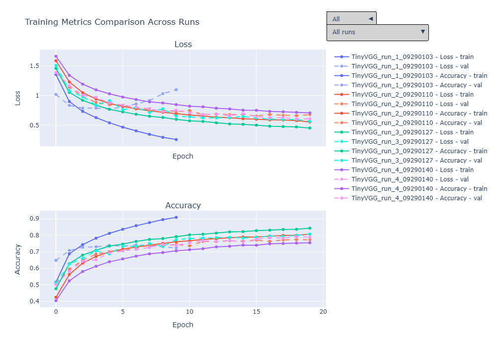

# Simple CNN for Cifar10
TinyVGG-inspired CNN architecture for solving Cifar10. 

## Design
Baseline Model: TinyVGG with data normalisation and early stopping, trained in mini-batches with Adam optimizer ([run 1](run_config/run_1.yaml)). [Model code.](models/tiny_vgg.py)

Additional experiments:  
- \+ Data augmentation ([run 2](run_config/run_2.yaml))  
- \+ Batch normalisation ([run 3](run_config/run_3.yaml))  
- \+ Dropout ([run 4](run_config/run_4.yaml))  

Validation results are compared across runs, and the best model is selected for evaluation on the test set.


## Results
### Validation
Screenshot from the simple dashboard for run comparison in [compare_runs.ipynb](compare_runs.ipynb):
[](images/compare_runs.png)
The run result `.json` files are provided in the `metrics` directory, and can be used to run the dashboard.

Validation results of the best model for each run:

| Run   | Train Loss | Val Loss | Train Accuracy | Val Accuracy | Train Time (s) | Epochs |
|-------|------------|----------|----------------|--------------|----------------|--------|
| **Run 3** | **0.45**       | **0.57**     | **0.84**           | **0.81**         | **671.11**         | **20**     |
| Run 4 | 0.71       | 0.60     | 0.75           | 0.79         | 670.73         | 19     |
| Run 2 | 0.60       | 0.66     | 0.79           | 0.77         | 529.21         | 16     |
| Run 1 | 0.54       | 0.77     | 0.81           | 0.74         | 148.32         | 5      |

Based on these the model from Run 3 was chosen and evaluated on the test set. Note that Run 3 didn't trigger early stopping, so further training would likely be beneficial. Similarly, run 4 did end with early stopping (just barely), but since the dropout layers make learning more difficult, it might also benefit from longer training, perhaps with an adjusted learning rate. This could also prove not to be true since the TinyVGG architecture is quite simple meaning that dropout could just hinder it as it doesn't have enough capacity/parameters to overfit the data.

### Test
TinyVGG -- [experiment setup 3](run_config/run_3.yaml)

| Dataset     | Accuracy | Loss   |
|------------|---------|--------|
| Train      | 0.84    | 0.45   |
| Validation | 0.81    | 0.57   |
| **Test**       | **0.83**    | **0.52**   |

[](images/conf_matrix.png)
83% accuracy is decent performance for such a small model. The current state of the art is Giant AmoebaNet with GPipe 99% accuracy, so Cifar10 is essentially solved, but the model has a billion parameters ([Ref](https://github.com/RedditSota/state-of-the-art-result-for-machine-learning-problems)).

The model does worst on (in order from worst):
- cats – confused with dogs
- airplanes – confused with birds and ships
- horses – confused with dogs and deer
- dogs – confused with cats

The model gets most confused between cats and dogs, and it's understandable, as sometimes they do look quite a like:
[](images/catndog.png)

Also, sometimes there can be data quality issues, can you tell that this is a ship?
[](images/ship.png)

## Improvements
Experiment more:
- More epochs for the promising models with more regularisation
- Hidden units
- Learning rate
- Batch size

Implementation ideas:
- Learning rate scheduling
- Different optimisers
- Continued training from saved checkpoints of the most promising models.
- Other model architectures, e.g., miniResNet


# Running Custom Experiments
## ENV
The env used for developing this project was managed by Conda and is provided in `env.lock.yaml`. You can also clone the repo on a managed platform like Colab or replicate the dependencies manually.

## Workflow
- Define your run/experiment. Use the provided `.yaml` configuration files for reference.
- Run the `train_model.py` script with the appropriate configuration file. e.g.
```bash
python train_model.py --config ./run_config/run_1.yaml
```
- this will save model metrics into the `metrics` directory and save model checkpoints into the `checkpoints` directory.
- you can then compare multiple runs with `compare_runs.ipynb`, which will read the metrics from the `metrics` directory and plot the results.
- choose the best model according to the validation score and evaluate it on the test set with `final_results.ipynb`.

The data should be automatically downloaded when you run the training script if not present in the `data` folder. However, you can also use [utils/data_loading.py](utils/data_loading.py) if you wish to manually load the data for exploration or experimentation.